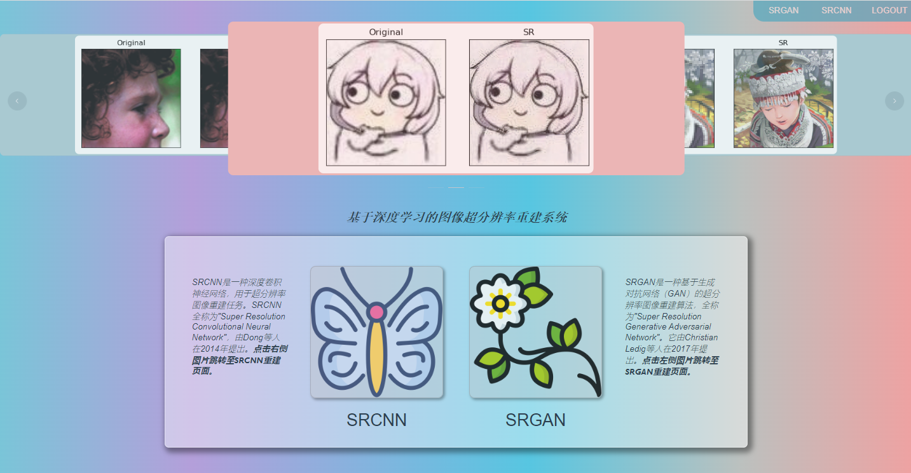
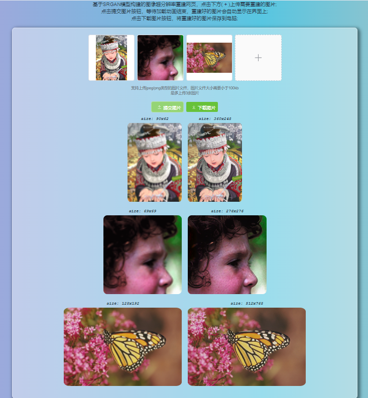

# 图像超分辨率重建系统

## 环境

* win10
* npm 9.5.0
* python 3.8.5
* mysql 8.0

## 启动前端

```txt
cd frontend
npm install
npm run serve
```

## 启动后端

```txt
cd backend
pip install -r requirement.txt

cd ..
python run ./backend/app.py
```

## 效果展示

### 主页



### 重建效果



## 目录结构

```txt
.
├─ .vscode
│  └─ launch.json
├─ backend                          # 后端文件目录
│  ├─ app.py                        # 后端接口文件
│  ├─ config.py                     # 后端全局设置文件
│  ├─ images                        # 后端图片资源目录
│  ├─ model.py                      # SR模型结构文件
│  ├─ net                           # 网络参数目录
│  ├─ utils.py                      # 操作组件文件
│  ├─ requirements.txt              # 依赖
│  └─ __pycache__
└─ frontend                         # 前端文件目录
   ├─ .browserslistrc
   ├─ babel.config.js
   ├─ jsconfig.json
   ├─ package-lock.json
   ├─ package.json
   ├─ public
   ├─ README.md
   ├─ src
   │  ├─ api                        # Axios对象封装
   │  ├─ App.vue
   │  ├─ assets                     # 前端图片资源目录
   │  ├─ components
   │  ├─ main.js                    # 前端全局配置文件
   │  ├─ registerServiceWorker.js
   │  ├─ router                     # 路由文件目录
   │  ├─ store                      # 存储数据目录
   │  ├─ utils                      # 操作组件目录
   │  └─ views                      # 视图目录
   └─ vue.config.js
```
